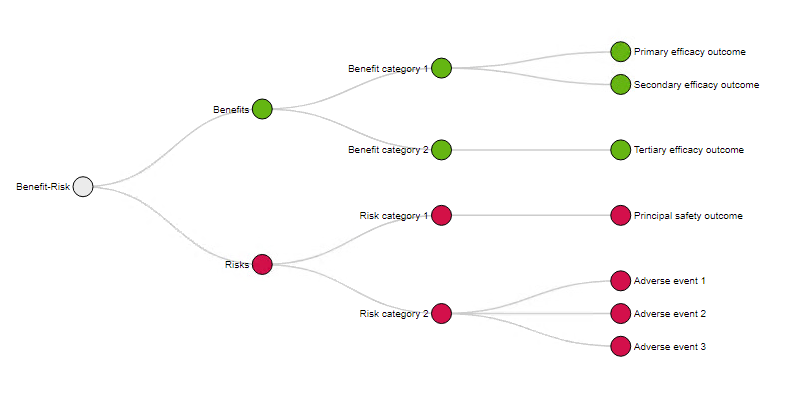

```{r, include = FALSE}
knitr::opts_chunk$set(
  collapse = TRUE,
  comment = "#>",
  fig.path = "man/figures/README-",
  out.width = "100%"
)
```

# BReasy 

<!-- badges: start -->
<!--[](https://lifecycle.r-lib.org/articles/stages.html#experimental) -->
<!-- badges: end -->

The BReasy R Shiny app provides a handy platform for structured benefit-risk assessment using clinical study or pooled data.
With the provided forest plot estimates for all relevant efficacy and safety outcomes can be shown in one graph. In the graphical display the presented outcomes can be separated into efficacy and safety. To enable a structured and transparent approach to assessing the benefit-risk profile, the outcomes shown in the forest plot are based on the same analysis sets and data scopes. 
Furthermore, a presentation by study (in case of pooled data), stratum and subgroups is possible to assess the benefit-risk profile in subpopulations of interest.

The following estimates for comparison can be presented with the BReasy Shiny app:

* Hazard Ratios;
* Excess number of subjects, for example based on Kaplan-Meier differences or risk differences;
* Odds Ratios; 
* Risk Differences;
* Relative risks.

An optional display of the following data is possible to be added to the forest plot:

* The actual estimates displayed in the forest plot;
* Event and patient counts; 
* Number needed to treat (NNT) / Number needed to harm (NNH).


Additionally, the BReasy app includes the possibility of creating a value tree showing the relevant benefit and risk criteria. Benefit criteria will be colour-coded as green, and the risk criteria will be colour-coded as red. The interactively created value tree can be saved in html format, please see below for an example.



## Installation

You can install the development version from [GitHub](https://github.com/) with:

``` r
# install.packages("devtools")
devtools::install_github(".../BReasy")
```

and start the app with:

```{r example}
#run_app()
```

## Data Manual

BReasy is designed to upload a CSV file containing effect estimates for outcomes of interest.


### File Structure

When uploading a CSV file the following formats are allowed and can be chosen in the app:

* Separator between variables
  + Comma, Semicolon or Tab 
* Quote highlighting variables
  + None, Double Quote (",'"',") or Single Quote (')
* Decimal character
  + None, Point (.) or Comma (,)
  
In case an incorrect setting is chosen the app might run into an error. 

### File Format

In order to use the BReasy, the CSV file has to include the following variables: 

<style>
table, th, td {
border: 1px solid black;
}
</style>
<table>
<tr>
<th style='width:10%;'>          </th>
<th style='width:20%;'> Variable: </th>
<th style='width:40%;'> Description: </th> 
<th style='width:10%;'> Type: </th>
</tr>
<tr>
<td rowspan='6'> Required Variables </td>
<td> ESTIMATE </td>
<td> Type of estimate as basis for comparison, e.g. crude incidence or Kaplan-Meier cumulative incidence </td>
<td> Character </td>
</tr>
<tr>
<td>ANALYSIS_SET</th>
<td>Analyis set</td>
<td>Character</td>
</tr>
<tr>
<td> OUTCOME </td>
<td> Outcome of interest </td>
<td> Character </td>
</tr>
<tr>
<td> EFFECT_xx </td>
<td> Variable containing the value of the estimate used for comparison
xx indicates the estimate chosen:
ARD = Risk difference
EXCESS = Excess number of subjects
HR = Hazard Ratio
OR = Odds Ratio
RR = Relative risk </td>
<td> Numeric </td>
</tr>
<tr>
<td> LOWERxx </td>
<td> Corresponding lower Confidence interval bound with xx indicating 1-alpha  </td>
<td> Numeric </td>
</tr>
<tr>
<td> UPPERxx </td>
<td> Corresponding upper Confidence interval bound with xx indicating 1-alpha </td>
<td> Numeric  </td>
</tr>

<tr>
<td rowspan='10'> Optional variables </td>
<td> NUMBER_EVENTS_VERUM </td>
<td> Number of events in verum group for the combination of required variables estimate,
outcome and analysis set and optional variables study, data scope, stratum, subgroup category </td>
<td> Integer </td>
</tr>

<tr>
<td>NUMBER_PATIENTS_VERUM </td>
<td>Number of patients in the verum group for the combination of required variables analysis set and optional variables study, stratum and subgroup category </td>
<td>Integer </td>
</tr>

<tr>
<td>NUMBER_EVENTS_COMP </td>
<td>Number of events in comparator group for the combination of required variables estimate, outcome and analysis set and optional variables study, data scope, stratum, subgroup category </td>
<td> Integer</td>
</tr>

<tr>
<td>NUMBER_PATIENTS_COMP </td>
<td> Number of patients in the comparator group for the combination of required variables analysis set and optional variables study, stratum and subgroup category</td>
<td> Integer</td>
</tr>

<tr>
<td>STUDY/TRIALNO </td>
<td> Study identifier </td>
<td>Character </td>
</tr>

<tr>
<td> DATA_SCOPE/AVISIT</td>
<td> Data scope, e.g. treatment-emergent</td>
<td> Character</td>
</tr>

<tr>
<td>SUBGROUP </td>
<td>Subgroup of Interest - Values of 'Any', 'All' or 'Overall' or 'None' can be used for overall estimates </td>
<td>Character </td>
</tr>

<tr>
<td>SUBLEVEL </td>
<td> Subgroup category corresponding to SUBGROUP</td>
<td>Character </td>
</tr>

<tr>
<td>STRATUM </td>
<td> Stratum</td>
<td> Character</td>
</tr>

<tr>
<td> NNT</td>
<td> Number needed to treat (NNT) / Number needed to harm (NNH)</td>
<td> Integer</td>
</tr>
</table>

If the data is stored in more than one file of the same format, it is possible to upload several CSV files into BReasy.

The maximal file size is 40 MB.